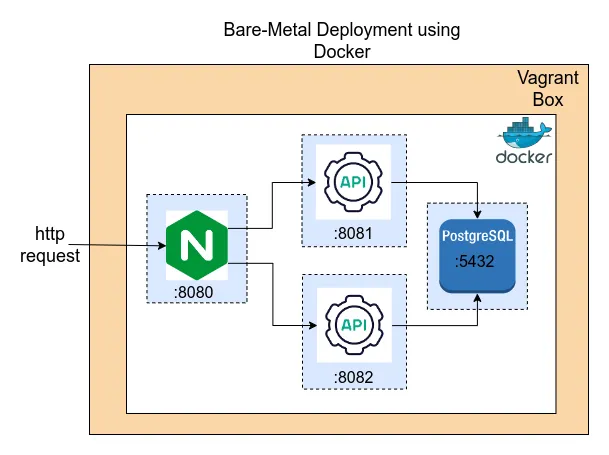

## Student CRUD REST API using Go and PostgreSQL
This API provides functionalities to create, read, update, and delete student information.

**Features:**

Create new student entries
Read existing student data (individually or all)
Update student information
Delete student records
Getting Started

**Prerequisites:**

Go installed on your system (https://go.dev/doc/install)
PostgreSQL server running locally or on a remote host (https://www.postgresql.org/download/)
Clone the Repository:


```bash
git clone https://github.com/dev-palkhe/student-api.git
Set Up Environment Variables:
```
Create a file named .env at the root of your project.
Add your database connection details to the .env file:
POSTGRES_HOST=localhost
POSTGRES_PORT=5432
POSTGRES_USER=your_username
POSTGRES_PASSWORD=your_password
POSTGRES_DB=student_api_db
Important: Replace your_username, your_password, and student_api_db with your actual database credentials.

**Run Migrations (Optional):**

If you have existing migrations, run them to create or update the database schema:

```bash
go run ./cmd/migrations -migrate
```
Start the Server:

Run the main Go application to start the API server:


```bash
go run ./cmd/main.go
```

**Usage**

The API endpoints are typically accessed through standard HTTP methods (GET, POST, PUT, DELETE) and accept JSON data for requests. You can use tool like Postman, curl.

**API Endpoints**


Endpoint	Method	Description
/students	GET	Retrieves a list of all students.

/students/:id	GET	Retrieves details of a specific student by ID.

/students	POST	Creates a new student entry.

/students/:id	PUT	Updates existing information for a student based on the provided ID.

/students/:id	DELETE	Deletes a student record with the specified ID.


Create a GET request to http://localhost:8080/students to retrieve all students.

Create a POST request to http://localhost:8080/students with a JSON body containing student data (e.g., name, email) to create a new student.

Create a GET request to http://localhost:8080/students/:id (replacing :id with the actual student ID) to retrieve details of a specific student.

Create a PUT request to http://localhost:8080/students/:id with a JSON body containing updated student data (e.g., name) to modify an existing student.

Create a DELETE request to http://localhost:8080/students/:id (replacing :id with the actual student ID) to delete a student record.

**Simply deploy using docker-compose**
Here you can simply pull image from my dockerhub 
(Make sure you have docker compose installed )
Else install it from (https://docs.docker.com/compose/install/)

```bash
docker pull devasheesh22/student-api:v1
```

```bash 
docker compose build
docker commpose up

```
Also once testet run
```bash
docker dompose down
```
(Make sure after testing to run)
```bash
docker compose down
```

**Using makefile**
```bash
make up
```
(Also once tested run)
```bash
make down
```


**Using vagrant file**

Vagrant is the command line utility for managing the lifecycle of virtual machines.
Make sure you have vagrant installed on your machine and also you must have a oracle virtual box.
By running the following command you can run the app on baremetal.
```bash
vagrant up
```
(After successfull testing run)
```bash
vagrant down
```



## Deploying the app on kubernetes

You can either use Kind or minikube ,I have used kind as it consumes less resources .

create a cluster.yaml file
```bash
kind: Cluster
apiVersion: kind.x-k8s.io/v1alpha4
nodes:
  - role: control-plane
    image: kindest/node:v1.29.2@sha256:51a1434a5397193442f0be2a297b488b6c919ce8a3931be0ce822606ea5ca245
  - role: worker
    image: kindest/node:v1.28.7@sha256:9bc6c451a289cf96ad0bbaf33d416901de6fd632415b076ab05f5fa7e4f65c58
  - role: worker
    image: kindest/node:v1.28.7@sha256:9bc6c451a289cf96ad0bbaf33d416901de6fd632415b076ab05f5fa7e4f65c58
  - role: worker
    image: kindest/node:v1.28.7@sha256:9bc6c451a289cf96ad0bbaf33d416901de6fd632415b076ab05f5fa7e4f65c58
```

Make sure the docker daemon is running!
```bash
kind create cluster --config cluster.yaml 
```

```bash
kind get nodes
##You will get a similiar optput like this :
kind-worker3
kind-control-plane
kind-worker2
kind-worker
```
**Label the nodes** 
```bash
kubectl get nodes
NAME                 STATUS   ROLES           AGE   VERSION
kind-control-plane   Ready    control-plane   31s   v1.29.2
kind-worker          Ready    <none>          7s    v1.28.7
kind-worker2         Ready    <none>          10s   v1.30.0

$ kubectl label nodes kind-worker student-info-app=true
node/kind-worker labeled
$ kubectl label nodes kind-worker2 student-info-app=true
node/kind-worker2 labeled

```
# Using hashicorp vault and ESO for injecting secrets :

# Vault Setup Guide

## Install Vault
Follow the official documentation to run Vault on Kubernetes, or use the following commands:

```bash
helm repo add hashicorp https://helm.releases.hashicorp.com
helm search repo hashicorp/vault
helm install vault hashicorp/vault -n vault --create-namespace
```
```bash
kubectl port-forward vault-0 8200:8200 -n vault

kubectl get pods -l app.kubernetes.io/name=vault
## A simliar output like this is expected
NAME      READY   STATUS    RESTARTS   AGE
vault-0   0/1     Running   0          1m49s
```
# Initialize one Vault server:

```bash
Copy code
kubectl exec -ti vault-0 -n vault -- vault operator init

##Example output:
Copy code
Unseal Key 1: MBFSDepD9E6whREc6Dj+k3pMaKJ6cCnCUWcySJQymObb
Unseal Key 2: zQj4v22k9ixegS+94HJwmIaWLBL3nZHe1i+b/wHz25fr
Unseal Key 3: 7dbPPeeGGW3SmeBFFo04peCKkXFuuyKc8b2DuntA4VU5
Unseal Key 4: tLt+ME7Z7hYUATfWnuQdfCEgnKA2L173dptAwfmenCdf
Unseal Key 5: vYt9bxLr0+OzJ8m7c7cNMFj7nvdLljj0xWRbpLezFAI9

Initial Root Token: s.zJNwZlRrqISjyBHFMiEca6GF

Unseal the Vault server using the unseal keys:
Copy code
kubectl exec -ti vault-0 -n vault -- vault operator unseal # Use Unseal Key 1
kubectl exec -ti vault-0 -n vault -- vault operator unseal # Use Unseal Key 2
kubectl exec -ti vault-0 -n vault -- vault operator unseal # Use Unseal Key 3
```
# Export Vault Address
Set the Vault address for your local environment:

```bash
export VAULT_ADDR='http://127.0.0.1:8200'
```

```bash
$ vault login 
Token (will be hidden): 
WARNING! The VAULT_TOKEN environment variable is set! The value of this
variable will take precedence; if this is unwanted please unset VAULT_TOKEN or
update its value accordingly.

Success! You are now authenticated. The token information displayed below
is already stored in the token helper. You do NOT need to run "vault login"
again. Future Vault requests will automatically use this token.

Key                  Value
---                  -----
token                s.cdWzApasdkfjkasdqMHnuv
token_accessor       o03balkkjadskdfjd+uw4k
token_duration       ∞
token_renewable      false
token_policies       ["root"]
identity_policies    []
policies             ["root"]
```

# Enable new kv engine
```bash
vault secrets enable -version=2 -path=argocd kv
#To list all your current secerets
vault secrets list
#Create test secert
vault kv put argocd/mysecret DB_URL= <your db url> , DB_username = <db username > ,DB_password = <db pass >
#Enable approle at path approle
vault auth enable approle
#Create a vault policy
vault policy write read-policy -<<EOF
# Read-only permission on secrets stored at 'argocd/data'
path "argocd/*" {
capabilities = [ "read", "list" ]
}
EOF
#Now create a role
vault write auth/approle/role/argocd token_policies="read-policy"
#Read Policy
vault read auth/approle/role/argocd
#Get role-id
vault read auth/approle/role/argocd/role-id

Key     Value
---     -----
role_id 675a50e7-cfe0-be76-e35f-49ec009731ea
#Get Secert ID
vault write -force auth/approle/role/argocd/secret-id

Key                 Value
---                 -----
secret_id           ed0a642f-2acf-c2da-232f-1b21300d5f29
secret_id_accessor  a240a31f-270a-4765-64bd-94ba1f65703c
#TEST if AppRole you cerate is working or not
#Login using your app role
vault write auth/approle/login role_id="675a50e7-cfe0-be76-e35f-49ec009731ea"
secret_id="ed0a642f-2acf-c2da-232f-1b21300d5f29"
#List secret
vault kv list argocd/
#Read Secert
vault kv get argocd/mysecret

```
## External-secrets-operator

External Secrets Operator is a Kubernetes operator that integrates external secret management systems like AWS Secrets Manager, HashiCorp Vault, Google Secrets Manager, Azure Key Vault, IBM Cloud Secrets Manager, and many more. The operator reads information from external APIs and automatically injects the values into a Kubernetes Secret.

# Install Secret operator
```bash
helm repo add external-secrets https://charts.external-secrets.io

helm install external-secrets \
external-secrets/external-secrets \
    -n external-secrets \
    --create-namespace \
    --set installCRDs=true
```
# Create App role for Vault using Vaule App Role
```bash
# Create a secret by update your secret id in vault-secret.yaml file.
kubectl apply -f vault-secret.yaml
#Create a secret store.
kubectl apply -f secretstore.yaml
#Now create a externl secret to get the secret
kubectl apply -f external-secret.yaml  

```
## Apply the manifests from k8s folder

```bash
kubectl apply -f ns.yaml

kubectl apply -f pv.yaml

kubectl apply -f cm.yaml

kubectl apply -f database.yaml

kubectl apply -f app.yaml

```
## Deploying application using helm chart :

Using helm charts we manually wont need to apply all the manifests from k8s folder, follow the steps below:

```bash
kubectl create ns student-info-app
cd ESO #to inject the serets
kubectl apply -f vault-secret-token.yaml
kubectl apply -f secreststore.yaml
kubectl apply -f external-secret.yaml

cd helm
# using helm we wont need to apply all the manifests .
helm install student-api-v1 ./student-api-chart


## To access the k8s application use :

```bash
kubectl port-forward svc/student-api-service 8080:80 -n student-info-app
```

## Install Argo CD
# Install Argo CD using manifests
```bash
kubectl create namespace argocd
kubectl apply -n argocd -f https://raw.githubusercontent.com/argoproj/argo-cd/stable/manifests/install.yaml
```
# Access the Argo CD UI (Loadbalancer service)
```bash
kubectl patch svc argocd-server -n argocd -p '{"spec": {"type": "NodePort"}}'
```
# To access the argocd UI 
```bash
kubectl port-forward svc/argocd-server -n argocd 8084:443
```
localhost://8084 is where you can access the argocd UI.

Once forwaded select advanced and allow the it then a login portal for argocd will appear .

The username is admin and to for password do the following steps:
```bash
kubectl get secrets -n argocd
NAME                          TYPE     DATA   AGE
argocd-initial-admin-secret   Opaque   1      116m
argocd-notifications-secret   Opaque   0      118m
argocd-redis                  Opaque   1      116m
argocd-secret                 Opaque   5      117m


kubectl edit secret argocd-initial-admin-secret -n argocd 
#copy the password and simply quit by escaping and :q!
```
The encoded password needs to be decoded :

echo < encoded pass > | base64 --d

< the original pass > #copy it and paste in UI 

Fill in all the details as per your configuration in your project .

Once successfully synced you can access and track all tha changes !!!

Any commit or change in codebase will trigger the pipeline !!!

To Access the appliaction dont forget to port forward :

```bash
kubectl port-forward svc/student-api-service 8080:80 -n student-info-app 
# You can access the application by doing this 
```
# Application would look like this 


# Argocd will look for any changes made and you look after all the objects using argocd


# Integrating with PLG (promtail ,loki ,prometheus & grafana)
```bash
helm repo add grafana https://grafana.github.io/helm-charts 
helm repo update
helm search repo loki
helm show values grafana/loki-stack > values.yaml
vim values.yaml
#(just change promtail and prometheus enabled from false to true)
#save it
helm install --values values.yaml loki grafana/loki-stack

kubectl get pod
NAME                            READY   STATUS    RESTARTS   AGE
loki-0                          1/1     Running   0          2m3s
loki-grafana-597cbfc4c9-hxd99   2/2     Running   0          2m3s
loki-promtail-7ft5k             1/1     Running   0          2m3s
loki-promtail-bsls8             1/1     Running   0          2m3s
loki-promtail-h7h7g             1/1     Running   0          2m3s
kubectl port-forward pod/loki-grafana-597cbfc4c9-hxd99 3000:3000 # for the UI to start
Forwarding from 127.0.0.1:3000 -> 3000
Forwarding from [::1]:3000 -> 3000
# Copy and paste the secret from loki-secret which is base64 encoded decode it
```
In graphana UI you will have grafana loki pre-configured access it and you can check for all the logs over there !


# Add prometheus as a data source and fetch all the metrics in graphana UI


# Integrating Slack for alerts using Grafana 

Create your workspace 

Add an an application and further create a webhook URL

Copy the webhook URL

In Grafana UI go to Alerts & notification create custom alert and paste the slack webhook URL ,once done you will recieve a natification 


# Above PLG configuration doesn't download prometheus CRDs and grafana built-in dashboards So for alerting and scraping metrics from a postgres exporter we follow the steps:

```bash 
# Delete the helm loki chart
helm install monitoring prometheus-community/kube-prometheus-stack 

helm install postgres-exporter prometheus-community/prometheus-postgres-exporter -f postgres-exporter.yaml -n student-info-app

# Check that postgres exporter pod is running in student-info-app namespace:
kubectl get pods -n student-info-app
NAME                                                             READY   STATUS    RESTARTS   AGE
postgres-6d77f9d6fd-ph5zr                                        1/1     Running   0          14m
postgres-exporter-prometheus-postgres-exporter-f5c569585-znzh7   1/1     Running   0          5m54s
student-api-86bc7b49fb-zx9gd                                     1/1     Running   0          14m

# port forward the following ports to access the DB metrics exporter, grafana & prometheus by :

kubectl port-forward service/monitoring-grafana 3000:80 #Grafana UI

kubectl port-forward svc/monitoring-kube-prometheus-prometheus 9090:9090 #promethues UI

kubectl port-forward service/postgres-exporter-prometheus-postgres-exporter 9187:80 -n student-info-app #DB metric UI

kubectl port-forward svc/student-api-service 8080:80 -n student-info-app # Our application
```
## Prometheus Postgres metric exporter


## The metrics within postgres DB


## Default dashboards for Grafana


